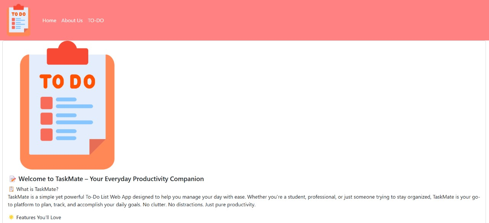
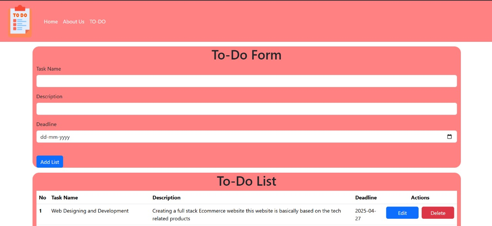
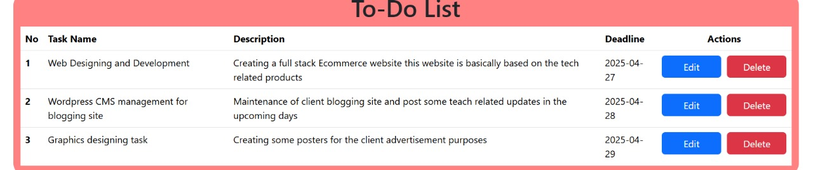
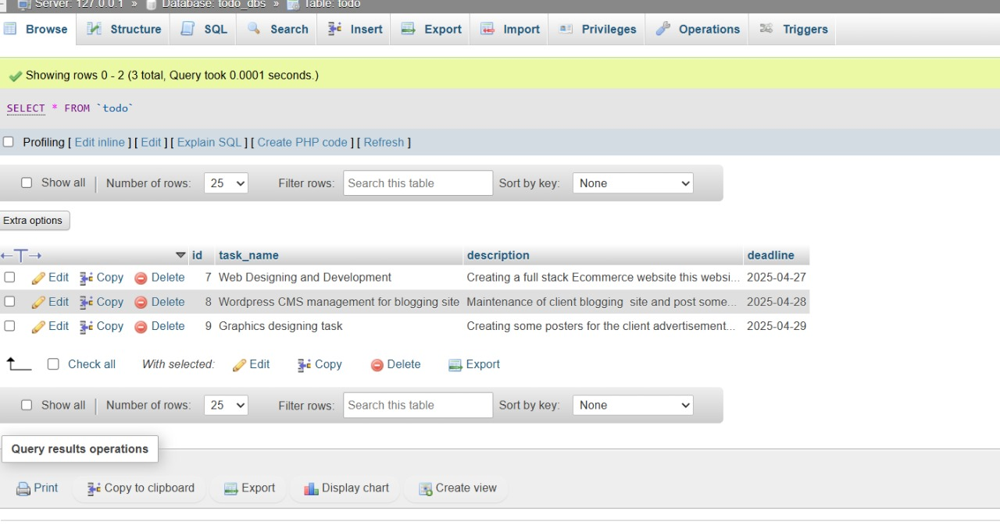

# 📝 ToDo Web App

## 🔍 Overview
This ToDo Web Application is a simple task management tool that allows users to add, edit, delete, and view tasks with details such as task name, description, and deadline. The app is built using HTML, CSS, Bootstrap, JavaScript for the frontend and PHP with MySQL for the backend.

---

## 🌐 Pages

### 🏠 Home Page
- Displays a welcome message and navigation bar.
- Contains links to the ToDo page and About Us page.

### ℹ️ About Us Page
- Provides information about the developer.
- Describes the purpose and tech stack used in the project.

### ✅ ToDo Page
- Includes a form with the following fields:
  - **Task Name**
  - **Detailed Description**
  - **Deadline**
- Features a button to add the task.
- Displays a list of added tasks in a table.
- Provides **Edit** and **Delete** functionalities for each task.

---

## 🧰 Tech Stack

### Frontend:
- HTML5
- CSS3
- Bootstrap
- JavaScript

### Backend:
- PHP

### Database:
- MySQL

---

## ✨ Features

- Add tasks with task name, description, and deadline.
- Edit existing tasks.
- Delete tasks with a click.
- Display tasks in a table format.
- Fully dynamic with database connectivity.

---

## 🧠 Backend Logic

- The form data is submitted using HTML and JavaScript.
- PHP files (`todo.php`, `edit.php`, and `delete.php`) handle task CRUD operations.
- Data is stored in a MySQL table named `todo`.
- JavaScript is also used to update the UI dynamically on client side and validate data before submission.

---

## 🗃️ Database Structure

**Table Name**: `todo`

| Column Name    | Type                      | Description             |
|----------------|---------------------------|-------------------------|
| id             | INT (11) NOT NULL         | Unique task ID          |
| task_name      | VARCHAR(100) NOT NULL     | Name of the task        |
| description    | VARCHAR(255) NOT NULL     | Task description        |
| deadline       | DATE NOT NULL             | Deadline for the task   |

---

## 🛠 How to Run the Project

1. **Clone or Download** this repository.
2. Open `phpMyAdmin` and import the `todo.sql` file into a new database (e.g., `todo_dbs`).
3. Update database credentials in `db.php` file:
   ```php
   $conn = mysqli_connect("localhost", "root", "", "todo_db");
   ```
4. Start Apache and MySQL using XAMPP or LAMP.
5. Open `index.php` in the browser using `http://localhost/php-test-13/index.php`.

---

## 📁 Folder Structure

```
/todo-web-app
│
├── index.php             # Home page
├── About us.php          # About page
├── todo.php              # Insert task
├── edit.php              # Update task
├── delete.php            # Delete task
├── todo-database/
│   └── todo.sql          # DB schema
├── screenshots/          # UI screenshots for README/docs
│   ├── Home.jpeg
│   ├── About-Us.jpeg
│   └── ToDo_Form.jpeg 
|   └── ToDo_List.jpeg
|   └── Database.jpeg 
```

---

## 📸 Screenshots

### Home Page  


### About Us Page  


### Task Form Filled  


### Task List Display with Actions  


### Database


---

## 🧑‍💻 Developer

**Pushpendu Mondal**  
Role: Web Developer  
Project built as part of a basic assessment to demonstrate frontend and backend skills.  
Email: *pushpendumondal851@gmail.com*  
LinkedIn: *[linkedin-profile](https://www.linkedin.com/in/pushpendu-mondal-b2010a284/)*

---

## 🔗 Submission

Please access the full project from the shared [https://github.com/pushpendumondal851/Todo-web-app.git](https://github.com/pushpendumondal851/Todo-web-app.git)

> ⏰ Deadline: **24-Apr-2025, 11:00 PM**

---
